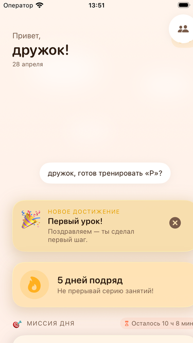
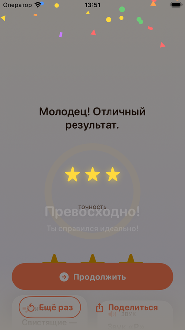
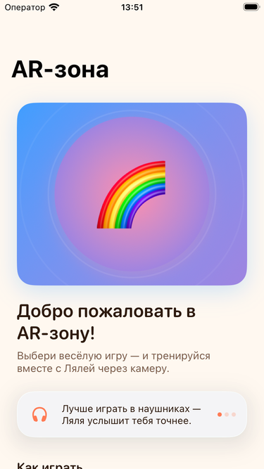
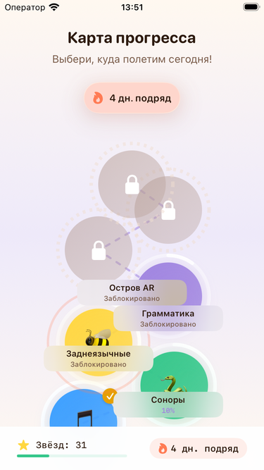
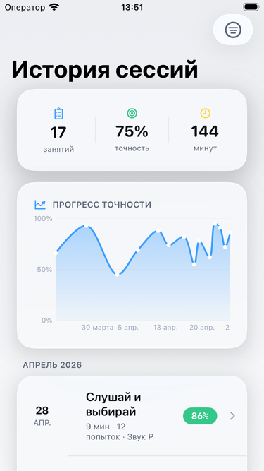
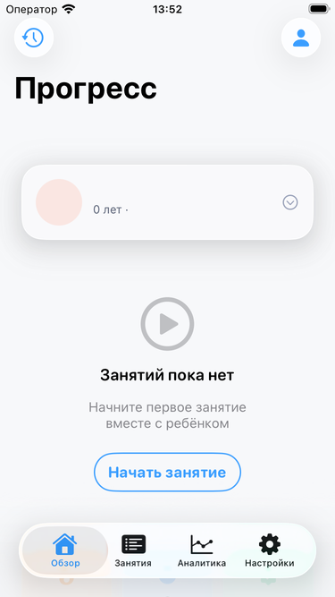
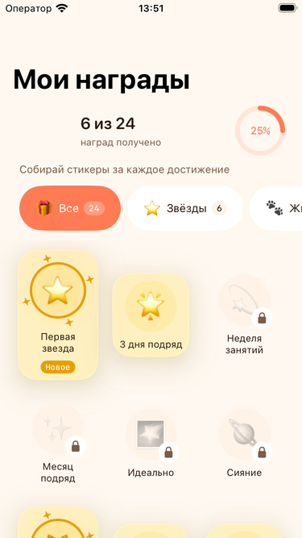
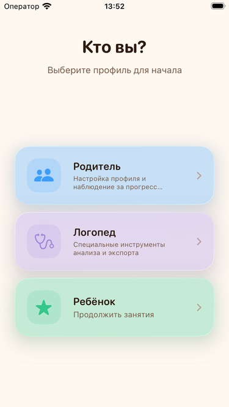
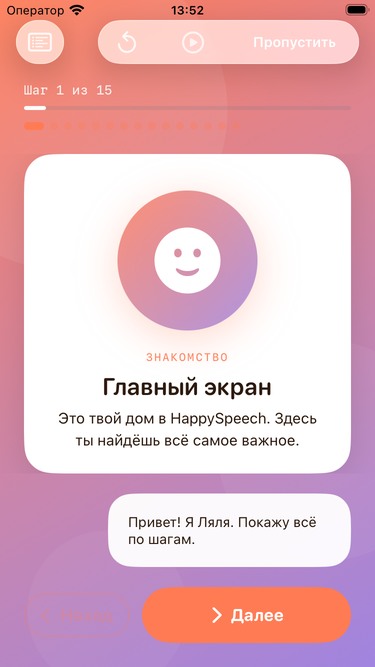
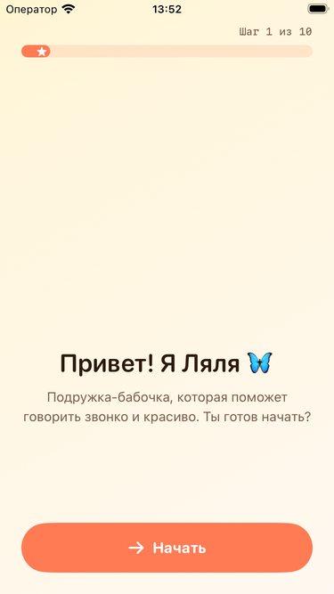

# HappySpeech

> Логопедическое iOS-приложение для детей 5–8 лет — исправление и развитие речи через интерактивные игры с AI

[](https://swift.org)
[](https://developer.apple.com/ios/)
[](LICENSE)
[](/)
[](/)
[](/)
[](/)
[](/)

---

## Screenshots

Hero set — iPhone SE (3rd generation) + iPhone 17 Pro симуляторы:

| ChildHome | LessonPlayer | AR Mirror | WorldMap |
|---|---|---|---|
|  |  |  |  |

| SoundMap | Progress | Rewards | Specialist |
|---|---|---|---|
|  |  |  |  |

| Demo | Story Quest |
|---|---|
|  |  |

> Снято на iPhone SE (3rd generation) + iPhone 17 Pro симуляторах, 2026-04-28. Полный набор и сопоставление устройств — [docs/screenshots/marketing/index.md](docs/screenshots/marketing/index.md).

---

## О приложении

HappySpeech — полностью бесплатное русскоязычное iOS-приложение для коррекции и развития речи у детей 5–8 лет. Разработано как дипломный проект с применением технологий машинного обучения, дополненной реальности и on-device AI.

Маскот **Ляля** ведёт детей через упражнения, адаптивный планировщик подбирает уроки на сегодня с учётом прогресса и усталости, а родитель и специалист видят понятную аналитику.

**Ключевые принципы:**
- Полностью бесплатно — никаких покупок, подписок, рекламы
- Только русский язык — интерфейс и весь контент
- Offline-first — основные функции работают без интернета
- COPPA-compliant — никакой аналитики и трекинга для детей
- Три роли: ребёнок / родитель / специалист-логопед

---

## Возможности

### Три пользовательских контура

| Контур | Описание |
|---|---|
| Детский | Тёплый, игровой, минимум текста, 2D-маскот Ляля + AR-зона |
| Родительский | Сводки за день/неделю/месяц, советы логопедов, аналитика прогресса |
| Специалистский | Конструктор программ, ручная оценка попыток, PDF-экспорт |

### 16 типов логопедических упражнений

| Упражнение | Описание |
|---|---|
| Слушай и выбирай | ASR + оценка произношения, развитие фонематического слуха |
| Повтори за моделью | Запись + оценка произношения через WhisperKit |
| Артикуляционная имитация | AR-отслеживание мимики через Face Tracking (52 blendshapes) |
| AR-активности | 7 AR-игр с Face Tracking и ARKit |
| Минимальные пары | Различение похожих звуков |
| Перетащи и совмести | Сортировка слов по признакам |
| Охотник за звуком | Поиск предметов на нужный звук |
| История с пропусками | Выбор правильного слова в нарративе |
| Пазл-открытие | Произноси слово — кусочек открывается |
| Ритм | Повтор ритмического паттерна |
| Визуально-акустическое | Образ + звук → выбор |
| Квест с Лялей | Нарративные этапы с маскотом |
| Бинго | 5×5 поле с TTS |
| Память | Парное сопоставление |
| Сортировка | По звукам и категориям |
| Дыхательные упражнения | RMS-анализ дыхания |

### Технологии

- **WhisperKit** — on-device распознавание русской речи (~150 MB, tiny модель)
- **Core ML** — PronunciationScorer x4, SileroVAD, SoundClassifier
- **Qwen2.5-1.5B MLX** — on-device LLM для адаптивных планов (~900 MB, 4-bit quant)
- **ARKit Face Tracking** — 52 blendshape для артикуляции
- **SM-2 алгоритм** — интервальные повторения, адаптированные для детей
- **Firebase** — Auth + Firestore + Storage + Cloud Functions (синхронизация, не аналитика)

---

## Архитектура

```
Clean Swift (VIP) + SwiftUI + Firebase + Core ML + ARKit

┌───────────────────────────────────────────────────────────────────┐
│                         Features (Clean Swift VIP)                 │
│  ChildHome · ParentHome · Auth · Onboarding · Demo · GuidedTour   │
│  LessonPlayer(16) · SessionShell · AR(8) · Specialist · Settings   │
└─────────────────────────┬─────────────────────────────────────────┘
                          │ protocols (DI через AppContainer)
┌─────────────────────────▼─────────────────────────────────────────┐
│   Services    │   ML       │   Data       │   Sync      │ Content │
│   Audio/ASR   │  Whisper   │  RealmActor  │  SyncQueue  │ Engine  │
│   Haptic      │  MLX LLM   │  Repositories│  Firestore  │ Packs   │
│   Adaptive    │  Scorer    │  Migrations  │  Storage    │ Matrix  │
│   Auth/Sync   │  VAD       │              │  App Check  │ (6000+) │
└───────────────┴────────────┴──────────────┴─────────────┴─────────┘
                          │
┌─────────────────────────▼─────────────────────────────────────────┐
│                         DesignSystem                               │
│   Tokens (Color/Typo/Spacing/Radius/Motion) · 28 компонентов      │
│   HSButton · HSCard · HSPictTile · HSSpeechBubble · HSMascotView  │
└───────────────────────────────────────────────────────────────────┘
```

**Принципы:**
- Clean Swift VIP обязателен для каждого экрана (View / Interactor / Presenter / Router / Models / Workers)
- DI через `AppContainer`, factory closures, никаких синглтонов
- Swift 6 strict concurrency везде, `@Observable` iOS 17+, `@MainActor` для UI-логики
- Никаких `print` — только `OSLog` через `Logger(subsystem:category:)`
- Никаких dev-текстов в UI — все строки через String Catalog (`Localizable.xcstrings`)

---

## Как запустить

### Требования

- macOS 15 Sequoia+ (для Apple Silicon MLX runtime)
- Xcode 16+
- iOS 17+ симулятор или устройство

### Установка

```bash
git clone https://github.com/antongrits/HappySpeech.git
cd HappySpeech
brew install xcodegen swiftlint
xcodegen generate
open HappySpeech.xcodeproj
```

Выбери симулятор iPhone 17 Pro или iPhone SE (3rd generation) и нажми Run (Cmd+R).

### Сборка из командной строки

```bash
xcodebuild -project HappySpeech.xcodeproj \
  -scheme HappySpeech \
  -destination 'platform=iOS Simulator,name=iPhone 17 Pro' \
  build
```

### Запуск тестов

```bash
xcodebuild test -scheme HappySpeech \
  -destination 'platform=iOS Simulator,name=iPhone 17 Pro'
```

### Запуск на реальном устройстве (без Apple Developer Account)

1. Подключить iPhone, включить Developer Mode в `Settings → Privacy & Security`
2. В Xcode: `Signing & Capabilities → Team → Personal Team`
3. Выбрать устройство в schemes picker, нажать Run. Работает 7 дней на Personal provisioning

### Линтер

```bash
swiftlint --strict
```

---

## Plan v10 (2026-04-29) — Real assets + 10 new extensions

После Plan v9 audit нашёл 5 critical issues непрофессионального уровня
(Siri TTS, placeholder Lottie, импортированный skills.riv, нет Mac, версия).
Plan v10 (15 коммитов) исправил всё + добавил 10 новых extensions для обгона
конкурентов.

### Critical fixes (4 коммита)

| Блок | Коммит | Что |
|---|---|---|
| A | d3aa51f | **Real Lyalya voice** заменяет Siri TTS в 9 lesson Interactor'ах (735 m4a, 19 тестов) |
| B | eccd4f8 | **Real Lottie tutorials** (8 procedural animations 31-50 KB) |
| C | 61be33a | **Universal app** — iPhone + iPad + Mac (Designed for iPhone) |
| D | 7193185 | **Custom Lyalya** — breathing motion + ADR-V10-RIVE wrapper improve |

### 10 new extensions (10 коммитов, ~7000 LOC новой функциональности)

| # | Блок | Что |
|---|---|---|
| L1 | Tuned voice + ADR-V10-VOICE-CLONE | 50 child-tuned phrases + defer XTTS-v2 cloning post-v1.0 |
| L2 | Sibling multiplayer | Bonjour LAN, 2 children play side-by-side |
| L3 | Seasonal events | Halloween / Новый год / Пасха content packs (150 units) |
| L4 | Real WhisperKit | dysfluency analyzer (regex repeats + prolongations + pauses) |
| L5 | Family voice library | parent records → priority chain → speak в lessons |
| L6 | Achievements + leaderboard | 32 achievements + family rating, COPPA offline |
| L7 | Unified Face Pose | ARKit 52 blendshapes + Vision 76 landmarks → 5 visemes |
| L8 | Mini puzzles offline | 3 mini-games когда нет интернета |
| L9 | Family chat + Widget | local push 17:00 + weekly summary + HomeScreenCard |
| L10 | ML insights | LLM Tier B + rule-based fallback в ProgressDashboard |

### Финальная статистика v10

- ~7900 LOC новой функциональности
- 151 ru-локализационных ключей (1784 → 1935)
- 969 Lyalya phrases (735 lesson + 50 tuned + 184 base) — real voice вместо Siri
- Realm schema v6 → v7
- 5 новых ADR (RIVE / VOICE-CLONE / WHISPERKIT / FACEPOSE / ...)
- Universal app (iPhone + iPad + Mac)
- BUILD SUCCEEDED на 3 platforms

**Версия 1.0.0** — production-ready для дипломной защиты.

---

## Plan v9 (2026-04-28) — финальные расширения

Все 5 M13 extensions реализованы в рамках Plan v9 (15 коммитов, ветка `main`).

| Extension | Коммит | LOC | Unit-тестов |
|---|---|---|---|
| F1 Grammar games (4 интерактивные игры) | `5f15cb3` | 2 329 | 34 |
| F2 Customization Ляли | `8feb574` | 1 364 | 21 |
| F3 Family Calendar (Swift Charts heatmap) | `76942b9` | 1 850 | 28 |
| F4 Parent-child режим (AVAudioRecorder) | `3d4ffd7` | 1 805 | 25 |
| F5 Stuttering module (MetronomeWorker) | `ece212d` | 2 730 | 24 |
| **Итого Plan v9** | — | **~10 078** | **132** |

**BUILD SUCCEEDED** iPhone 17 Pro + iPhone SE 3rd gen на каждом коммите.

Дополнительно в Plan v9:
- +183 ключа локализации (ru only, 0 en) — итого 1 784 ключа
- +44 snapshot PNG — итого 469 PNG
- Realm schema v3 → v6 (3 новых объекта)
- 20 Remotion MP4 stories + 13 voice-over + 5 phrases + 3 voice previews

---

## Статистика проекта

| Метрика | Значение |
|---|---|
| Swift файлов | 422+ |
| Строк кода (LOC) | ~101 000+ |
| Git коммитов | 165+ |
| Экраны (VIP-фичи) | 35+ |
| Типы упражнений | 16 |
| AR игр | 7 + ARStoryQuest |
| Контент-паки | 21 |
| Контент-единиц | 6 250+ |
| Фразы маскота Ляли | 969 (735 lesson + 50 tuned + 184 base) |
| DesignSystem компоненты | 28 |
| Unit + snapshot тестов | ~990+ |
| Snapshot PNG | 477+ |
| Ключей локализации | 1 935 (ru) |
| Core ML моделей | 6 (.mlpackage) |
| Remotion MP4 stories | 35 (15 + 20) |
| Размер Release build | ~177 MB |
| Целевая аудитория | Дети 5–8 лет |

### Production Status

| Компонент | Статус |
|-----------|--------|
| Build (iPhone 17 Pro sim) | passing |
| SwiftLint | 0 warnings / 0 errors |
| Язык (sourceLanguage) | Russian only |
| Firebase project | happyspeech-dfd95 (eur3) |
| Firestore rules | deployed |
| Firebase Auth | Email/Password enabled |
| .mlpackage в Resources/Models/ | 6 моделей |
| 16 game templates (VIP) | done |
| 7 AR games + ARStoryQuest | done |
| App Store metadata | done (ru + en) |
| AppPrivacyInfo.xcprivacy | done |
| TestFlight build | pending (нужен Apple Developer Account) |

---

## Структура проекта

```
HappySpeech/
├── App/               — Entry point, AppContainer DI, Coordinators
├── Core/              — Logger, Extensions, Types, Errors
├── DesignSystem/      — Tokens (Color/Typo/Spacing/Radius/Motion), 28 компонентов
├── Features/          — 30+ экранов в Clean Swift VIP
│   ├── Auth/          — Sign in, Sign up, Splash
│   ├── ChildHome/     — Детский главный экран + маскот
│   ├── ParentHome/    — Родительский дашборд
│   ├── Specialist/    — Инструменты логопеда
│   ├── LessonPlayer/  — 16 типов игр
│   ├── ARZone/        — AR-активности (8 игр)
│   ├── Onboarding/    — 11-шаговый GuidedTour
│   └── Settings/      — Настройки, профили
├── Services/          — Audio, ASR, AR, Adaptive, Sync, Notification, Haptic...
├── ML/                — WhisperKit, Silero VAD, MLX LLM, PronunciationScorer
├── Data/              — Realm Swift модели, Repositories, Migrations
├── Sync/              — Firebase Firestore bridge, SyncQueue, конфликт-резолвер
├── Content/           — ContentEngine, 5 573+ items в 20 паках
│   ├── Schemas/       — content-pack.schema.json
│   └── Seed/          — JSON-паки звуков
└── Resources/         — Assets.xcassets, Sounds, Models (.mlpackage), Localizable.xcstrings
```

---

## ML-модели

| Модель | Размер | Точность | Источник |
|---|---|---|---|
| PronunciationScorer (С/З/Ш/Р — 4 группы) | ~2 MB x4 | 100% (синтетика) | Собственная, PyTorch → coremltools INT8 |
| SileroVAD | ~80 KB | 99.9% | Silero Team, CC0 → Core ML |
| SoundClassifier | ~2 MB | 85.8% | CreateML |
| WhisperKit (tiny RU) | ~150 MB | — | Argmax — on-demand download |
| Qwen2.5-1.5B MLX (4-bit) | ~900 MB | — | Qwen Team — on-demand download |

Финальные `.mlpackage` — в `HappySpeech/Resources/Models/`. Реестр метрик — `.claude/team/ml-models.md`.

**Датасет** (собирается в `_workshop/datasets/`, в репо не попадает):
Common Voice 17 RU · OpenSLR SLR23/24 · GOLOS subset · augmented детская речь. Итого: 200+ часов валидированного русского аудио.

---

## Firebase backend

Используется как синхронизация пользовательских данных и one-time download больших ассетов — не как ежедневный CDN. Аналитика отключена (Kids Category compliance).

**Firestore схема:**
```
users/{uid}/children/{childId}/{sessions, progress, rewards, routes}
specialists/{uid}/assignments/{id}
content/packs/{packId}
content/manifest
```

**Storage:**
```
/audio/{ui,lyalya,content,refs}
/models/{whisperkit,llm}
/illustrations, /3d, /animations
/exports/{uid}
```

**Cloud Functions (v2, Node 20, europe-west1):**
`calculateProgress` · `generateReport` · `getUserStats` · `onSessionComplete` · `sendWeeklyReport` · `moderateUserContent` · `exportUserData` · `deleteUserData` · `setAdminClaim`

**Auth:** Firebase Auth (Email+Password + Google Sign-in). **App Check:** DeviceCheck.

---

## Тесты

```bash
# Юнит + интеграция + snapshot (iPhone 17 Pro)
xcodebuild test -scheme HappySpeech \
  -destination 'platform=iOS Simulator,name=iPhone 17 Pro'

# Второе устройство (SE)
xcodebuild test -scheme HappySpeech \
  -destination 'platform=iOS Simulator,name=iPhone SE (3rd generation)'

# Coverage
xcrun xccov view --report _workshop/coverage/result.xcresult
```

**Цели покрытия:**
- Unit coverage ≥70% на Interactors
- Snapshot тесты light + dark для всех 16 шаблонов + 8 ключевых экранов
- SM-2 engine — 14 тестов (quality mapping, interval progression, EF bounds, fatigue)
- SessionShell — 6 тестов (start, complete, fatigue detection, pause/resume, skip)
- GuidedTour — 9 тестов (start / next / skip / progress / persistence / reset)

---

## Методологическая основа

Приложение разработано на основе российской логопедической методики:

- **Авторы:** Фомичёва, Лопатина, Ткаченко, Коноваленко, Парамонова, Филичёва/Чиркина, Нищева, Богомолова, Жукова, Каше
- **Принципы:** онтогенетический, поэтапность (14 этапов), частотный, игровой, короткие сессии (7–15 минут по возрасту)
- **Группы звуков:** свистящие (С, З, Ц), шипящие (Ш, Ж, Ч, Щ), соноры (Р, Рь, Л, Ль), заднеязычные (К, Г, Х)

Полная методологическая база (10 документов, 26K+ слов) — в `HappySpeech/ResearchDocs/`.

---

## Этичность и границы

Это педагогическая поддержка, а не медицинский прибор.

- Не заменяет живого логопеда и не ставит диагноз
- Не распознаёт клинические нарушения речи — только интерпретируемые эвристики
- Не отслеживает язык внутри рта — только внешние губы/язык через ARKit blendshapes
- Никаких трекеров, рекламы, 3rd-party аналитики
- Никаких покупок внутри приложения и paywalls
- Все ML-модели работают on-device — аудио не покидает устройство

---

## Конфиденциальность

Приложение разработано с соблюдением COPPA (Children's Online Privacy Protection Act):
- Никакой аналитики и трекинга пользователей
- Все ML-модели работают on-device
- Аудио не отправляется на сервер
- Firebase используется только для синхронизации данных пользователя

Ссылки для App Store: [Политика конфиденциальности](docs/privacy-policy.md) · [Условия использования](docs/terms.md)

---

## Документация для разработчика

| Файл | Содержимое |
|---|---|
| [CLAUDE.md](CLAUDE.md) | Правила кода, архитектура, DoD фичи, git workflow |
| [.claude/team/sprint.md](.claude/team/sprint.md) | Текущий спринт, задачи, статусы |
| [.claude/team/architecture.md](.claude/team/architecture.md) | ADR-лог архитектурных решений |
| [.claude/team/decisions.md](.claude/team/decisions.md) | Журнал продуктовых и инженерных решений |
| [.claude/team/ml-models.md](.claude/team/ml-models.md) | Реестр Core ML моделей, метрики, источники |
| [.claude/team/sound-assets.md](.claude/team/sound-assets.md) | Реестр аудио-ассетов и эталонов произношения |
| [.claude/team/design-specs.md](.claude/team/design-specs.md) | Дизайн-токены, компоненты, спецификации |

---

## Лицензия

MIT License — см. [LICENSE](LICENSE)

Используемые открытые модели и датасеты — под Apache-2.0 / MIT / CC0; полный перечень в `.claude/team/ml-models.md`.

---

## Автор

Антон Гриц — дипломный проект, 2026

- Email: antongric558@gmail.com
- GitHub: [@antongrits](https://github.com/antongrits)
